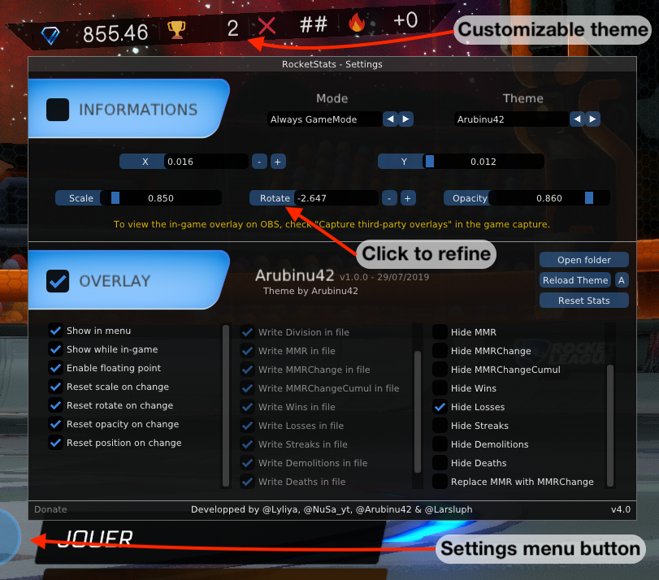

# RocketStats

RocketStats is a Plugin working with bakkesmod, allowing you to display session information (MMR, win, loss, streak) in game and/or in OBS.

## Installation

### Prerequisites

First, you'll need to install [Bakkesmod](https://www.bakkesmod.com/)

### Installing

In game, **press F2**, open the **plugins tab**, open the **plugin manager**, fill the box on the right with **30** and press **"Install By Id"**

### Access the menu

For the moment you have to go through the "Plugins" menu of BakkesMod (**press F2**), you will find in the list "RocketStats Plugin".

On the other hand, it is quite possible to interact with the menu and the overlay via keyboard shortcuts.
To do this, go to the BakkesMod menu (**press F2**) called "Bindings".
Then click on **Add**, then on **None** and press the key you want to use to show/hide the overlay or menu.
To finish, double-click on the first line of the list, type one of the commands below, before clicking twice on **Save**:
 - All RocketStats (overlay and menu): `togglemenu rocketstats`
 - Menu only: `toggle cl_rocketstats_settings 0 1`

## Overlay

RocketStats is provided with 2 types of overlay, one in-game, and one designed for streamers in OBS.

### In Game Overlay

We offer a new system that allows you to make your own InGame overlay themes.
Fortunately for those who are not comfortable with creating themes, we already offer a few.

To Add/Edit themes, you can go to the directory below, or simply open the folder from the RocketStats menu:
 - `%appdata%\bakkesmod\bakkesmod\RocketStats\RocketStats_themes`

Les explications sur ce système sont présentes ici: https://github.com/Arubinu/RocketStats/tree/themes/RocketStats_themes

### OBS Overlay

This is an example of the OBS Overlay, you can display information on your stream and style it your way using custom video and font.

You can still redirect to this project to have overlay themes for OBS already built: https://github.com/Arubinu/Overlay4RocketStats

#### Installation

You can find the example background video by [Rimey](https://twitter.com/Rimey_) here : [Download link](https://drive.google.com/file/d/15ye_Iq-1lK_dkQKQvk_Ia5EwbTNEiViG/view?usp=sharing)

The font used for this overlay is [Azonix Regular](https://www.dafont.com/azonix.font)

Make a "media source" check "Local file" and point to where you stored the overlay video.

Keep in mind that the provided overlay is an example of what you can do, let your imagination create the overlay you love ! ;)

To display data such as win, loose, streak and MMRChange, make a "Text" source and select "Read from a file".

All the available data are gathered in text files which are located in the folder **%appdata%\bakkesmod\bakkesmod\RocketStats**.

To display the image of your rank you need to make a "Browser" source and configure it like this:

The file is in **bakkesmod\RocketStats\RocketStats_images** and its name is "rank.html"

You can also animate your stream while boosting !

Make a Browser source:

The file is in **bakkesmod\RocketStats\RocketStats_images** and its name is "boost.html"

You can change the logo displayed to put yours, you need two videos in the format ".webm" one named "boost.webm" and the other "noboost.webm".

## Community & Thanks :)

You can come and ask your questions or discuss with the community in our [discord](https://discord.gg/weBCBE4).

Thanks to all the people who helped us during the developpement

- [Maylie](https://www.twitch.tv/Maylie_tv) for ideas and support
- [Ekon](https://www.twitch.tv/ekonrl) for tests
- [Fuury](https://www.twitch.tv/FuuRy_Off) for tests

### Development Team & Contributors

- [Lyliya](https://twitter.com/Lyliiya)
- [Nusa](https://twitter.com/NuSa_yt)
- [Arubinu42](https://www.twitch.tv/arubinu42)
- Larsluph#7713
- Th3Ant#9411

The plugin is now Open Source, you can find the source code [here](https://github.com/Lyliya/RocketStats)

This plugin is provided for free, but if you like our work, you can support us at the following address: https://www.paypal.me/rocketstats or by sending BTC (only BTC) at 19qWGhpFTc5E9t9gvBYRyNK5ybdR8BioyK
